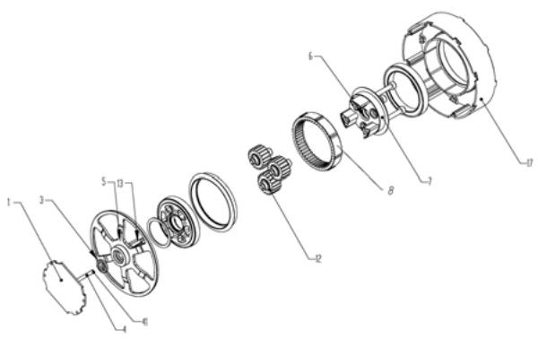
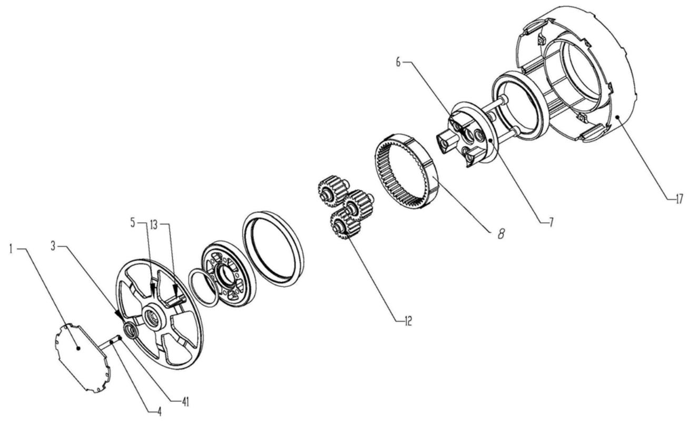
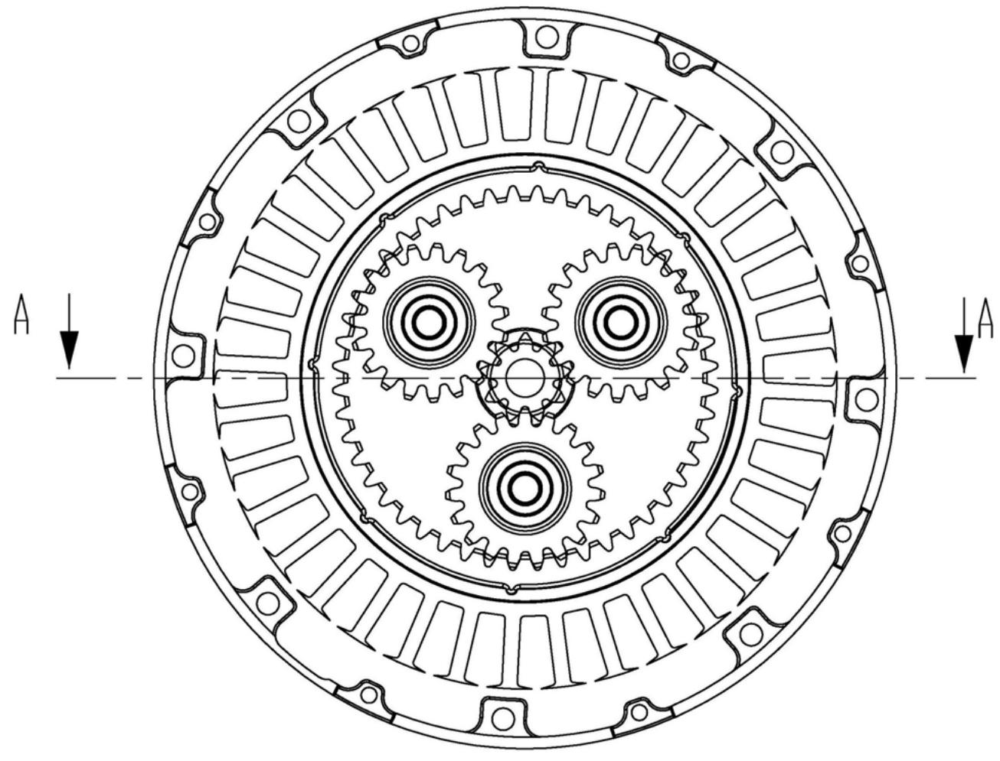
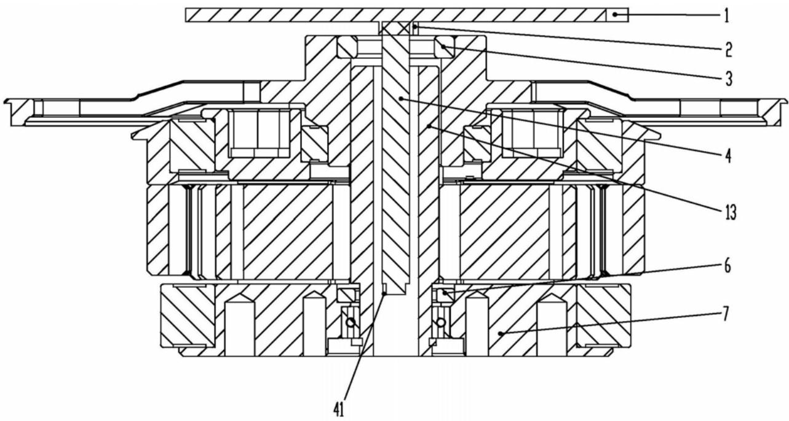
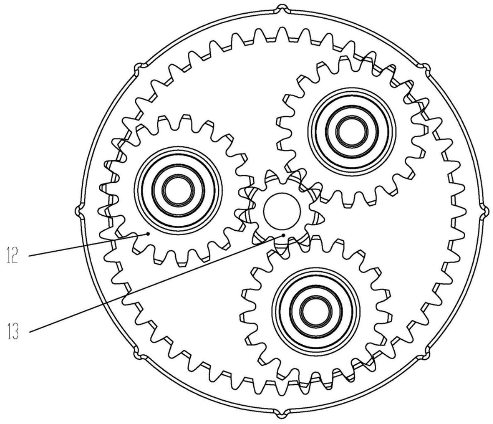
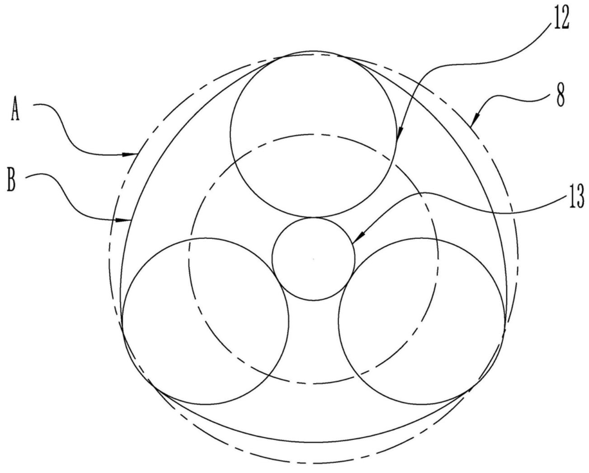
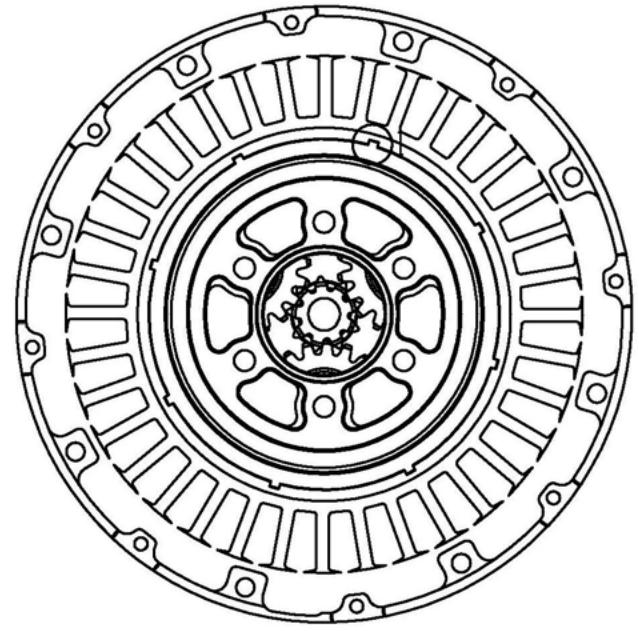
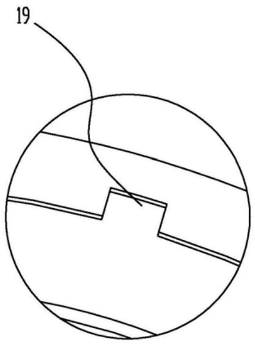
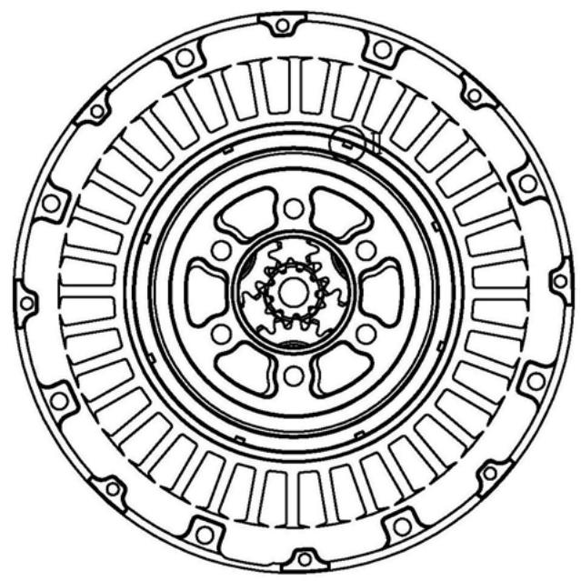
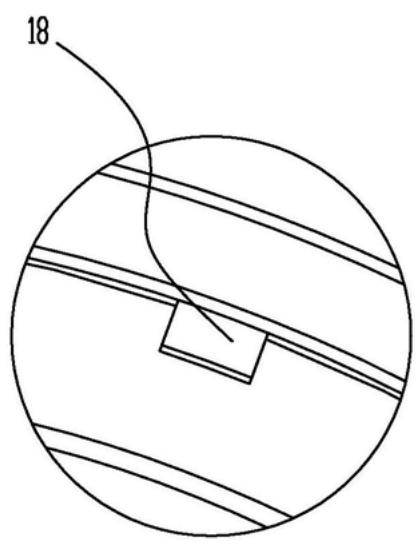

# (19)中华人民共和国国家知识产权局

# (12)实用新型专利

(10)授权公告号CN213034612U(45)授权公告日2021.04.23

(21)申请号202021894937.5

(22)申请日2020.09.02

(73)专利权人杭州宇树科技有限公司地址310053浙江省杭州市滨江区西兴街道东流路88号1幢306室

(72)发明人王兴兴

(74)专利代理机构浙江翔隆专利事务所（普通合伙）33206

代理人许守金

(51)Int.Cl.

B25J5/00(2006.01)

B25J9/10(2006.01)

B62D57/032(2006.01)

# (54)实用新型名称

一种结构紧凑的回转动力单元以及应用其的机器人

# (57)摘要

本实用新型公开了一种结构紧凑的回转动力单元以及应用其的机器人，属于动力单元以及机器人技术领域。现有回转单元方案，需要在输出端设置磁编码器，但会导致关节输出机构无法做到紧凑。本实用新型一种结构紧凑的回转动力单元在太阳轮设置具有中空腔的回转中心；并把输出端编码器芯片设置在回转中心的中空腔内。本实用新型经过不断探索以及试验，改变现有的输出端磁编码器的设置位置，在太阳轮的回转中心设置中空腔，所述中空腔能够容纳磁编码器的输出端编码器芯片，进而把输出端编码器芯片放置在中空腔中，能够有效减少磁编码器的空间占用，使得回转动力单元结构更加紧凑，结构简单、实用，方案切实可行。

1. 一种结构紧凑的回转动力单元，包括能够提供动能的电机、与电机转子相连接的太阳轮(13)、能够检测转动角度的磁编码器、用于装配电机的基座(17)；其特征在于，

所述太阳轮(13)在回转中心设置中空腔；

所述磁编码器包括输出端编码器芯片(41)；

所述基座(17)固接一能够穿设太阳轮(13)中空腔的支撑杆(4)；

所述支撑杆(4)上装配所述输出端编码器芯片(41)，并连同输出端编码器芯片(41)设置在太阳轮(13)的中空腔内。

2. 如权利要求1所述的一种结构紧凑的回转动力单元，其特征在于，

所述磁编码器设置一能够与输出端编码器芯片(41)磁性感应的输出端磁环(6)；

所述太阳轮(13)装配一行星架(7)；

所述输出端磁环(6)与行星架(7)共轴线安装在一起。

3. 如权利要求2所述的一种结构紧凑的回转动力单元，其特征在于，

所述太阳轮(13)的中空腔靠近输出端磁环(6)的一端敞口设置，所述输出端编码器芯片(41)靠近所述口或凸出于所述口。

4. 如权利要求2所述的一种结构紧凑的回转动力单元，其特征在于，

所述太阳轮(13)由非导磁材料制造而成。

5. 如权利要求4所述的一种结构紧凑的回转动力单元，其特征在于，

所述非导磁材料为铜合金或铝合金或不锈钢。

6. 如权利要求1所述的一种结构紧凑的回转动力单元，其特征在于，

所述电机的转子上同轴固定设有转子磁环(3)，转子磁环(3)侧部同轴布置有转子编码器芯片(2)。

7. 如权利要求1-6任一所述的一种结构紧凑的回转动力单元，其特征在于，

所述回转动力单元还包括能够与太阳轮(13)配合传动的行星轮(12)、能够对行星轮(12)施加张紧力的柔性内齿圈(8)；

所述行星轮(12)分别与所述太阳轮(13)和所述柔性内齿圈(8)啮合；

当所述行星轮(12)与所述柔性内齿圈(8)啮合传动时，

所述柔性内齿圈(8)向内张紧而对所述行星轮(12)施加朝向所述太阳轮(13)的径向挤压力，从而使得所述柔性内齿圈(8)和所述行星轮(12)保持充分接触啮合。

8. 如权利要求7所述的一种结构紧凑的回转动力单元，其特征在于，

所述柔性内齿圈(8)由具有一定伸缩量的材料制造而成，

所述材料包括但不限于塑料、不锈钢。

9. 如权利要求8所述的一种结构紧凑的回转动力单元，其特征在于，

所述行星轮(12)与行星架(7)相互之间的回转配合有一定的径向间隙。

10. 如权利要求9所述的一种结构紧凑的回转动力单元，其特征在于，所述柔性内齿圈(8)的外弧面和基座(17)的装配面择一设置具有限位作用的凸起部(18)；另一个设置相应的凹陷部(19)；所述凸起部(18)和凹陷部(19)圆周分布。

11. 一种四足机器人，其特征在于，包括如权利要求1-10任一所述的一种结构紧凑的回转动力单元。

# 一种结构紧凑的回转动力单元以及应用其的机器人

# 技术领域

[0001] 本实用新型涉及一种结构紧凑的回转动力单元以及应用其的机器人，属于动力单元以及机器人技术领域。

# 背景技术

[0002] 中国专利（公告号CN110405743A)公开了一种机器人关节减速输出机构，包括电机、行星减速器装置和位置反馈装置，行星减速器装置包括太阳齿轮、行星齿轮组、行星轴、销钉、内齿圈、角接触轴承、行星架基座、行星架压盖和输出端法兰盘，位置反馈装置包括磁性元件、磁编码器和信号连接线。其中，电机的电机输出轴与太阳齿轮固定，太阳齿轮带动行星齿轮组转动，实现第一次减速、增大扭矩；行星齿轮组带动内齿圈转动，实现第二次减速、增加扭矩；内齿圈与输出法兰盘固定，则输出端法兰盘随内齿圈一同转动。输出端法兰盘安装有磁性元件，磁编码器正对着磁性元件安装于行星架压盖内，实时读取输出端法兰盘的角度位置，配合驱动器实现高精度控制。

[0003] 上述在输出端设置磁编码器，能够提高驱动器的精度控制，但此磁编码器装配在行星架压盖内，导致此行星架压盖必须预留装配磁编码器的空间，进而使得行星架压盖体积较大，导致关节输出机构无法做到紧凑。

[0004] 进一步，上述方案的行星减速器由于齿轮等零部件的加工工艺的限制以及减速器装配过程中存在的装配误差，导致减速器组装好后往往存在较大的传动间隙。进而，随着齿轮的磨损，减速器的传动间隙也会增大。最终影响了减速器的回转精度；进而用户需要时常更换减速器，导致减速器的使用成本高。

# 实用新型内容

[0005] 针对现有技术的缺陷，本实用新型的目的一在于提供一种具有中空腔的太阳轮，所述中空腔装配磁编码器输出端编码器芯片，进而能够有效减少磁编码器的空间占用的结构紧凑的回转动力单元以及应用其的机器人。

[0006] 本实用新型的目的二在于提供一种能够对行星轮以及太阳轮施加张紧力的柔性内齿圈，从而使得所述柔性内齿圈和所述行星轮保持充分接触啮合，能够有效提高回转精度，延长使用寿命的回转动力单元以及应用其的机器人。

[0007] 为实现上述目的一，本实用新型的技术方案为：

[0008] 一种结构紧凑的回转动力单元，包括能够提供动能的电机、与电机转子相连接的太阳轮、能够检测转动角度的磁编码器、用于装配电机的基座；所述太阳轮在回转中心设置中空腔；

[0009] 所述磁编码器包括输出端编码器芯片；

[0010] 所述基座固接一能够穿设太阳轮中空腔的支撑杆；

[0011] 所述支撑杆上装配所述输出端编码器芯片，并连同输出端编码器芯片设置在太阳轮的中空腔内。

[0012] 本实用新型经过不断探索以及试验，改变现有的输出端磁编码器的设置位置，在太阳轮的回转中心设置中空腔，所述中空腔能够容纳磁编码器的输出端编码器芯片，进而把输出端编码器芯片放置在中空腔中，能够有效减少磁编码器的空间占用，使得回转动力单元结构更加紧凑，结构简单、实用，方案切实可行，构思巧妙。

[0013] 作为优选技术措施：

[0014] 所述磁编码器设置一能够与输出端编码器芯片磁性感应的输出端磁环；

[0015] 所述太阳轮装配一行星架；

[0016] 所述输出端磁环与行星架共轴线安装在一起。

[0017] 在回转动力单元的输出端，即行星架上设置输出端磁环，能够准确获取回转动力单元输出端的位置信息，进而提高回转动力单元的控制精度。

[0018] 作为优选技术措施：

[0019] 所述太阳轮的中空腔靠近输出端磁环的一端敞口设置，所述输出端编码器芯片靠近所述敞口或凸出于所述敞口，使得输出端磁环经过太阳轮的敞口位置，能够被输出端编码器芯片准确感应到，实现磁编码器的准确测量，结构简单、实用。

[0020] 作为优选技术措施：

[0021] 所述太阳轮由非导磁材料制造而成。

[0022] 如果太阳轮的中空腔用导磁的金属制造，当输出端编码器芯片装配位置离输出端磁环较远时，中空腔对输出端编码器芯片会形成磁屏蔽层，影响输出端编码器芯片对输出端磁环的准确感应，因此太阳轮最好采用非导磁材料制造而成。

[0023] 作为优选技术措施：

[0024] 所述非导磁材料为铜合金或铝合金或不锈钢，本领域技术人员可根据实际情况进行选择。

[0025] 作为优选技术措施：

[0026] 所述电机的转子上同轴固定设有转子磁环，转子磁环侧部同轴布置有转子编码器芯片。

[0027] 采用双编码器方案，相比单编码器方案，进一步提升了整个回转动力单元的控制精度。

[0028] 为实现上述目的二，本实用新型的技术方案为：

[0029] 所述回转动力单元还包括能够与太阳轮配合传动的行星轮、能够对行星轮施加张紧力的柔性内齿圈；

[0030] 所述行星轮分别与所述太阳轮和所述柔性内齿圈啮合；

[0031] 当所述行星轮与所述柔性内齿圈啮合传动时，

[0032] 所述柔性内齿圈向内张紧而对所述行星轮施加朝向所述太阳轮的径向挤压力，从而使得所述柔性内齿圈和所述行星轮保持充分接触啮合。

[0033] 本实用新型设置一能够对行星轮以及太阳轮施加张紧力的柔性内齿圈，从而使得所述柔性内齿圈和所述行星轮，即使存在加工以及装配误差，也能确保两者充分接触啮合。并且即使存在行星轮各齿轮出现磨损的状况，各齿轮之间依旧可以紧密的啮合，降低了减速器的传动间隙，进而提升了整个回转动力单元的输出精度，延长其使用寿命，构思巧妙，方案切实可行。

[0034] 作为优选技术措施：

[0035] 所述柔性内齿圈由具有一定伸缩量的材料制造而成，

[0036] 所述材料包括但不限于塑料、不锈钢。

[0037] 作为优选技术措施：

[0038] 所述行星轮与行星架相互之间的回转配合有一定的径向间隙。

[0039] 所述行星轮与所述行星架的转轴在径向方向存在一定的转动间隙，使得所述行星轮相对于所述行星架有一定的径向位移间隙，进而所述行星轮产生径向位移后可与所述太阳轮充分啮合，方案简单、实用。

[0040] 作为优选技术措施：

[0041] 所述柔性内齿圈的外弧面和基座的装配面择一设置具有限位作用的凸起部；另一个设置相应的凹陷部；所述凸起部和凹陷部圆周分布。

[0042] 所述柔性内齿圈对行星轮进行预紧时，需要承受来自行星轮传递的较大扭矩，此时设置凸起部和凹陷部，能够有效避免基座与柔性内齿圈沿圆周方向的相对滑动，进而避免柔性内齿圈从基座上挣脱，进而防止内齿圈因承重过大的扭矩而损坏，提高回转动力单元的使用寿命。

[0043] 作为优选技术措施：

[0044] 一种四足机器人，包括上述的一种结构紧凑的回转动力单元。

[0045] 本实用新型经过不断探索以及试验，改变现有的输出端磁编码器的设置位置，在太阳轮的回转中心设置中空腔，所述中空腔能够容纳磁编码器的输出端编码器芯片，进而把输出端编码器芯片放置在中空腔中，能够有效减少磁编码器的空间占用，使得四足机器人结构更加紧凑，结构简单、实用，方案切实可行，构思巧妙。

[0046] 本实用新型设置一能够对行星轮以及太阳轮施加张紧力的柔性内齿圈，从而使得所述柔性内齿圈和所述行星轮，即使存在加工以及装配误差，也能确保两者充分接触啮合。并且即使存在行星轮齿轮的磨损，各齿轮之间依旧可以紧密的啮合，降低了减速器的传动间隙，进而提升了整个回转动力单元的输出精度，延长四足机器人的使用寿命，构思巧妙，方案切实可行。

[0047] 与现有技术相比，本实用新型具有以下有益效果：

[0048] 本实用新型经过不断探索以及试验，改变现有的输出端磁编码器的设置位置，在太阳轮的回转中心设置中空腔，所述中空腔能够容纳磁编码器的输出端编码器芯片，进而把输出端编码器芯片放置在中空腔中，能够有效减少磁编码器的空间占用，使得回转动力单元以及四足机器人结构更加紧凑，结构简单、实用，方案切实可行，构思巧妙。

[0049] 本实用新型设置一能够对行星轮以及太阳轮施加张紧力的柔性内齿圈，从而使得所述柔性内齿圈和所述行星轮，即使存在加工以及装配误差，也能确保两者充分接触啮合。并且即使存在行星轮齿轮的磨损，各齿轮之间依旧可以紧密的啮合，降低了减速器的传动间隙，进而提升了整个回转动力单元的输出精度，延长回转动力单元以及四足机器人的使用寿命，构思巧妙，方案切实可行。

# 附图说明

[0050] 图1是本实用新型的爆炸图；

[0051] 图2是本实用新型的侧面示图；[0052] 图3是沿图2所示结构A- A剖视图；[0053] 图4是本实用新型的柔性减速器的啮合示意图；[0054] 图5是本实用新型的柔性减速器的内齿圈变形示意图；[0055] 图6是本实用新型一种结构示图以及I处凹陷部结构的放大示图；[0056] 图7是本实用新型一种结构示图以及II处凸起部结构的放大示图。[0057] 图中：1、驱动板；2、转子编码器芯片；3、转子磁环；4、支撑杆；41、输出端编码器芯片；5、电机转子；6、输出端磁环；7、行星架；8、柔性内齿圈；12、行星轮；13、太阳轮；17、基座；18、凸起部；19、凹陷部；A、原轮廓；B、变形后轮廓。

# 具体实施方式

[0058] 为了使本实用新型的目的、技术方案及优点更加清楚明白，以下结合附图及实施例，对本实用新型进行进一步详细说明。应当理解，此处所描述的具体实施例仅仅用以解释本实用新型，并不用于限定本实用新型。

[0059] 相反，本实用新型涵盖任何由权利要求定义的在本实用新型的精髓和范围上做的替代、修改、等效方法以及方案。进一步，为了使公众对本实用新型有更好的了解，在下文对本实用新型的细节描述中，详尽描述了一些特定的细节部分。对本领域技术人员来说没有这些细节部分的描述也可以完全理解本实用新型。

[0060] 如图1- 3所示，一种结构紧凑的回转动力单元，包括能够提供动能的电机、与电机转子相连接的太阳轮13、能够检测转动角度的磁编码器、用于装配电机的基座17；所述太阳轮13设置具有中空腔的回转中心；

[0061] 所述磁编码器包括输出端编码器芯片41；

[0062] 所述基座17固接一能够穿设太阳轮13中空腔的支撑杆4；

[0063] 所述支撑杆4上装配所述输出端编码器芯片41，并连同输出端编码器芯片41设置在回转中心的中空腔内。

[0064] 本实用新型经过不断探索以及试验，改变现有的输出端磁编码器的设置位置，在太阳轮13的回转中心设置中空腔，所述中空腔能够容纳磁编码器的输出端编码器芯片41，进而把输出端编码器芯片41放置在中空腔中，能够有效减少磁编码器的空间占用，使得回转动力单元结构更加紧凑，结构简单、实用，方案切实可行，构思巧妙。

[0065] 所述磁编码器设置一能够与输出端编码器芯片41磁性感应的输出端磁环6；

[0066] 所述太阳轮13装配一行星架7；

[0067] 所述输出端磁环6与行星架7共轴线安装在一起。

[0068] 在回转动力单元的输出端，即行星架7上设置输出端磁环6，能够准确获取回转动力单元输出端的位置信息，进而提高回转动力单元的控制精度。

[0069] 本实用新型磁编码器装配位置的一种具体实施例：

[0070] 所述太阳轮13的中空腔靠近输出端磁环6的一端敞口设置，所述输出端编码器芯片41靠近所述敞口或凸出于所述敞口，使得输出端磁环6经过太阳轮13的敞口位置，能够被输出端编码器芯片41准确感应到，实现磁编码器的准确测量，结构简单、实用。

[0071] 本实用新型太阳轮13制造材料的一种具体实施例：

[0072] 所述太阳轮13由非导磁材料制造而成。

[0073] 如果太阳轮13的中空腔用导磁的金属制造，当输出端编码器芯片41装配位置离输出端磁环6较远时，中空腔对输出端编码器芯片41会形成磁屏蔽层，影响输出端编码器芯片41对输出端磁环6的准确感应，因此太阳轮13最好采用非导磁材料制造而成。

[0074] 所述非导磁材料为铜合金或铝合金或不锈钢，本领域技术人员可根据实际情况进行选择。

[0075] 本实用新型双编码器方案的一种具体实施例：

[0076] 所述电机的转子上同轴固定设有转子磁环3，转子磁环3侧部同轴布置有转子编码器芯片2。

[0077] 采用双编码器方案，相比单编码器方案，进一步提升了整个回转动力单元的控制精度。

[0078] 本实用新型一种双编码器最佳实施例：

[0079] 一种结构紧凑的回转动力单元，包括基座17、设于所述基座17内的电机单元和减速器单元，所述电机单元包括电机转子5，所述减速器单元包括太阳轮13和行星架7，所述太阳轮13与所述电机转子5同轴固定连接，所述电机转子5上同轴固定设有转子磁环3，所述转子磁环3侧部同轴布置有转子编码器芯片2；所述行星架7上同轴固定设有输出端磁环6，与所述输出端磁环6同轴布置有输出端编码器输出端编码器芯片41；所述转子编码器芯片2和所述输出端编码器输出端编码器芯片41分别与所述基座17固定连接。

[0080] 进一步地，所述电机转子5侧部设有驱动板1，所述驱动板1与所述基座17固定连接，所述转子编码器芯片2固定设于所述驱动板1上；所述驱动板1上固定设有支撑杆4，所述支撑杆4穿过所述电机转子5及所述太阳轮13的回转中心，并延伸至所述输出端磁环6的侧部，所述输出端编码器芯片41设于所述支撑件的端部。

[0081] 进一步地，所述支撑杆4由弱磁材料制成。

[0082] 如图4- 7所示，本实用新型设置柔性内齿圈8的一种具体实施例：

[0083] 所述回转动力单元还包括能够与太阳轮13配合传动的行星轮12、能够对行星轮12施加张紧力的柔性内齿圈8；

[0084] 所述行星轮12分别与所述太阳轮13和所述柔性内齿圈8啮合；

[0085] 当所述行星轮12与所述柔性内齿圈8啮合传动时，

[0086] 所述柔性内齿圈8向内张紧而对所述行星轮12施加朝向所述太阳轮13的径向挤压力，从而使得所述柔性内齿圈8和所述行星轮12保持充分接触啮合。

[0087] 如图5所示，当存在加工、装配误差以及磨损时，柔性内齿圈8能够从轮廓A变形为轮廓B，确保两者保持充分接触啮合；进而各齿轮之间可以始终保持紧密的啮合，降低了减速器的传动间隙，进而提升了整个回转动力单元的输出精度，延长其使用寿命，构思巧妙，方案切实可行。

[0088] 本实用新型采用柔性减速器的最佳实施例：

[0089] 一种回转动力单元，包括太阳轮13、行星轮12、行星架7、柔性内齿圈8、与所述太阳轮13同轴固定连接的电机转子5、与所述电机转子5固定连接的电机座，所述电机座与所述基座17固定连接，所述行星架7通过轴承与所述电机座回转连接。

[0090] 所述行星轮12分别与所述太阳轮13和所述柔性内齿圈8啮合；所述行星轮12与行

星架7相互之间的回转配合有一定的径向间隙。当所述行星轮12与所述柔性内齿圈8啮合传动时，所述柔性内齿圈8向内张紧而对所述行星轮12施加朝向所述太阳轮13的径向挤压力，从而使得所述柔性内齿圈8和所述行星轮12充分接触啮合。

[0091] 本实用新型提供的自适应间隙的柔性减速器，其设置柔性内齿圈8和可产生径向位移的行星轮12，使行星轮12与太阳轮13充分啮合，进而提高了减速器的回转精度，降低了减速器的背隙，进而降低了对齿轮加工精度的要求而大大降低了成本，增大了回转单元的使用寿命。

[0092] 本实用新型柔性内齿圈8制造材料的一种具体实施例：

[0093] 所述柔性内齿圈8由具有一定伸缩量的材料制造而成，

[0094] 所述材料包括但不限于塑料、不锈钢；

[0095] 如图5- 7所示，本实用新型增设限位结构的一种具体实施例：

[0096] 所述柔性内齿圈8的外弧面和基座17的装配面择一设置具有限位作用的凸起部18；另一个设置相应的凹陷部19；所述凸起部18和凹陷部19圆周分布。

[0097] 所述柔性内齿圈8对行星轮进行预紧时，需要承受来自行星轮12传递的较大扭矩，此时设置凸起部18和凹陷部19，能够有效避免基座17与柔性内齿圈8沿圆周方向的相对滑动，进而避免柔性内齿圈8从基座17上挣脱，进而防止内齿圈因承重过大的扭矩而损坏，提高回转动力单元的使用寿命。

[0098] 本实用新型应用一种结构紧凑的回转动力单元的一种具体实施例：

[0099] 一种四足机器人，包括上述的一种结构紧凑的回转动力单元。

[0100] 本实用新型经过不断探索以及试验，改变现有的输出端磁编码器的设置位置，在太阳轮13的回转中心设置中空腔，所述中空腔能够容纳磁编码器的输出端编码器芯片41，进而把输出端编码器芯片41放置在中空腔中，能够有效减少磁编码器的空间占用，使得四足机器人结构更加紧凑，结构简单、实用，方案切实可行，构思巧妙。

[0101] 本实用新型设置一能够对行星轮12以及太阳轮13施加张紧力的柔性内齿圈8，从而使得所述柔性内齿圈8和所述行星轮12，即使存在加工以及装配误差，也能确保两者充分接触啮合。并且即使存在行星轮12齿轮的磨损，各齿轮之间依旧可以紧密的啮合，降低了减速器的传动间隙，进而提升了整个回转动力单元的输出精度，延长四足机器人的使用寿命，构思巧妙，方案切实可行。

[0102] 本申请中，固接或固定连接方式可以为螺接或焊接或铆接或插接或通过第三个部件进行连接，本领域技术人员可根据实际情况进行选择。

[0103] 以上所述仅为本实用新型的较佳实施例而已，并不用以限制本实用新型，凡在本实用新型的精神和原则之内所作的任何修改、等同替换和改进等，均应包含在本实用新型的保护范围之内。

  
图1

  
图2

  
图3

  
图4

  
图5

  
图6

  
图7

