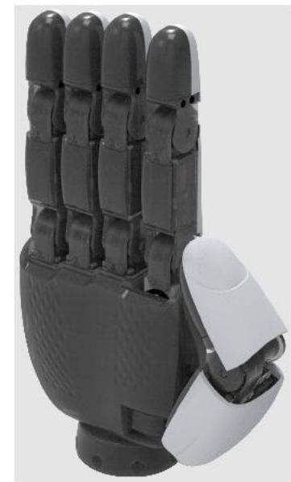
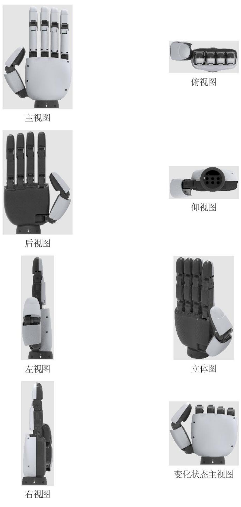
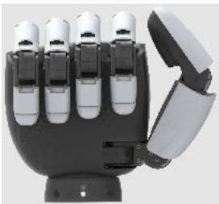
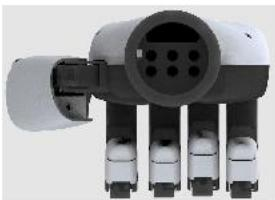
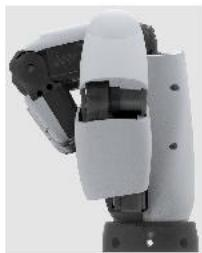
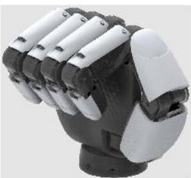
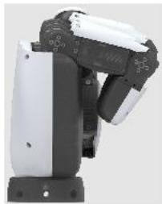
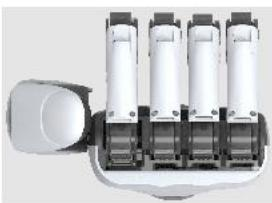

# (19)国家知识产权局

# (12)外观设计专利

(21)申请号202430526527.2

(22)申请日2024.08.20

(73)专利权人北京星动纪元科技有限公司地址100084北京市海淀区中关村东路1号院3号楼7层710

(72)设计人吴鑫全吴国良张志

(74)专利代理机构北京商专永信知识产权代理事务所（普通合伙）11400

专利代理师车江华

(51)LOC(14)CI. 15-99

  
图片或照片14幅简要说明1页 立体图

  
变化状态后视图

  
变化状态仰视图

  
变化状态左视图

  
变化状态立体图

  
变化状态右视图

  
变化状态俯视图

1. 本外观设计产品的名称:机械手(机器人灵巧手)。2. 本外观设计产品的用途:用于工业生产、商业或家庭服务、空间探索等场景的机器人。3. 本外观设计产品的设计要点:在于形状。4. 最能表明设计要点的图片或照片:立体图。